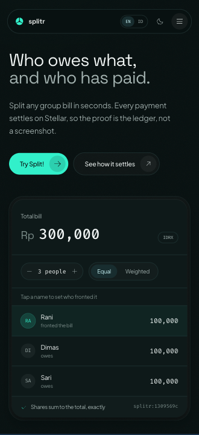
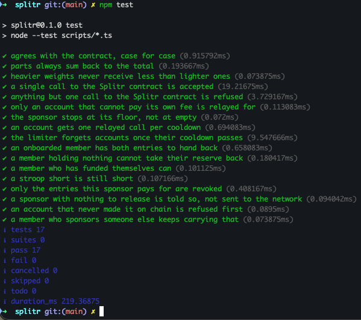

# Splitr

**Splitr** — Stablecoin Bill Splitting on Stellar, Settled and Proven On-Chain

- **Repository:** https://github.com/yazidalg/splitr
- **Contract (testnet):** [`CCMCFRZFQLLCUHY44VT2XYCIYNNQWIWFUVGPQXRDPP6XMFVGG4A4GWSD`](https://stellar.expert/explorer/testnet/contract/CCMCFRZFQLLCUHY44VT2XYCIYNNQWIWFUVGPQXRDPP6XMFVGG4A4GWSD)
- **Network:** Stellar testnet
- **Demo video:** _to add_

## Project Description

Splitr is a bill-splitting application built on the Stellar blockchain using the
Soroban SDK. It solves an ordinary problem that ordinary apps serve badly:
someone fronts the bill for dinner, then spends a week chasing four people for
their share. The transfers arrive in different apps, at different times, and the
only record that anyone paid is a screenshot in a group chat — which proves
nothing and can be edited.

Splitr replaces that record with the ledger. A bill is recorded on chain, the
smart contract computes each member's share itself, and settling a share moves
the money and writes the record **in the same invocation**. There is no "mark as
paid" button, because there is no state that could disagree with what actually
moved.

The system is deliberately more than one contract call. It is a complete
settlement path: a CLI for the operator, a landing page, a browser dApp that
never touches a private key, sponsored onboarding for members who own nothing,
and a fee relay so those members can still transact. Settlement happens in
`IDRX`, an IDR-pegged token this project issues on testnet, because the story it
serves is a Rupiah one.

## Project Vision

Our vision is to make "who has paid" a question the ledger answers rather than
one people argue about:

* **Ending Payment Disputes**: Replacing screenshots and memory with a record
  neither party can edit
* **Computing Shares On-Chain**: Having the contract calculate the split, so
  whoever created the bill cannot quietly give themselves a smaller share
* **Making Settlement Atomic**: Moving the asset and recording the payment in one
  invocation, so the transfer and the record can never disagree
* **Removing the Onboarding Wall**: Letting a member join and transact holding
  zero XLM, through sponsored reserves and fee-bumps
* **Keeping Custody With the User**: The web app never sees a secret key; members
  bring their own wallet
* **Serving a Real Currency Story**: Building around Rupiah-denominated
  settlement rather than a generic stablecoin demo

We envision group finance — arisan, shared households, trips, team lunches —
where the proof of payment is public, portable, and does not depend on trusting
the app that recorded it.

## Key Features

### 1. **On-Chain Bill Creation**

* Record a bill through the Soroban smart contract
* Specify a group name, settlement asset, total, members, and weights
* The **contract** computes every share; the client only supplies the inputs
* The payer's own share is marked settled on creation — they fronted the money
* Each member is indexed, so "my bills" is one call rather than a scan

### 2. **Exact Integer Splitting**

* Largest-remainder algorithm in integer units of 1e-7, Stellar's own precision
* Shares always sum back to the total exactly — never a lost stroop
* Equal or weighted splits (`2:1:1` for the person who ordered two mains)
* Deterministic tie-break by index, so every machine produces the same result
* Implemented **twice** — TypeScript and Rust — and pinned by tests on both sides

### 3. **Atomic Settlement**

* Settling calls the contract, which transfers through the asset's Stellar Asset
  Contract in the same invocation that records the payment
* Partial settlement is supported: pay half today, the rest later
* Overpayment is refused rather than clamped
* The payer cannot settle with themselves; a stranger cannot settle at all
* Either both the transfer and the record happened, or neither did

### 4. **Ledger-Based Reconciliation**

* A second, contract-free path settles with classic payments carrying a
  `splitr:<id>` memo
* `split reconcile` rebuilds who-paid-what by replaying Horizon payment history
* No local `paid` flag exists anywhere — adding one would defeat the core claim
* `split settle` reconciles before paying, so running it twice pays nothing the
  second time

### 5. **Onboarding a Member Who Owns Nothing**

* `wallet onboard` creates the account and its trustline inside a sponsorship
  sandwich, so the member starts at zero XLM
* A fee-bump lets that zero-balance member sign and submit transactions
* `api/relay.ts` does the same for the browser, guarded so it is not a faucet
* `wallet unsponsor` hands the reserves back once the member can carry them

### 6. **Non-Custodial Web App**

* `/app` connects Freighter, xBull, Albedo, Lobstr, Hana or Rabet
* The page never sees a secret key — signing happens inside the wallet
* Bilingual (English and Indonesian) with locale-correct number formatting
* Light and dark themes, and a layout that holds down to phone widths
* The chain client is lazily loaded, so a visitor who only reads the marketing
  page downloads none of it

## The Bill Data Structure

Each bill recorded by the contract contains:

| Field    | Type         | Description                                     |
| -------- | ------------ | ----------------------------------------------- |
| `id`     | `u32`        | Sequential identifier, assigned by the contract |
| `group`  | `String`     | What the bill was for                           |
| `asset`  | `Address`    | Stellar Asset Contract of the settlement asset  |
| `payer`  | `Address`    | Who fronted the money                           |
| `total`  | `i128`       | Total, in units of 1e-7 of the asset            |
| `shares` | `Vec<Share>` | One entry per member                            |

Each `Share` within a bill:

| Field    | Type      | Description                               |
| -------- | --------- | ----------------------------------------- |
| `member` | `Address` | Who owes this share                       |
| `weight` | `u32`     | Relative weight used to compute the share |
| `owes`   | `i128`    | What the contract calculated they owe     |
| `paid`   | `i128`    | What they have settled so far             |

Example bill, read back off testnet:

```text
Bill #6 · Bakso Malam
  total 30,000 IDRX, fronted by GASI…ZX7T

  PAID  GASI…ZX7T  weight  1  owes  10,000  paid  10,000
  PAID  GA3D…H4LM  weight  1  owes  10,000  paid  10,000
  PAID  GD36…VN4L  weight  1  owes  10,000  paid  10,000

Settled in full — this is the contract's own record, not a reconstruction.
```

Amounts are integers throughout. A 100,000 bill split three ways yields
`33333.3333334 / 33333.3333333 / 33333.3333333` — the extra stroop goes to the
first largest remainder, and the three sum back to exactly 100,000.

## Smart Contract Functions

The contract exports seven functions.

### `create_bill()`

Records a bill and computes what each member owes.

```text
payer, group, asset, total, members, weights
```

Requires the payer's authorisation. Refuses fewer than two members, a weight
count that does not match the member count, a non-positive total, or a payer who
is not on the bill. Returns the new bill id and emits a `Created` event.

### `settle()`

Pays off the caller's entire remaining share.

```text
id, member
```

Delegates to `settle_part` with whatever is left. Returns the amount transferred.

### `settle_part()`

Pays part of the caller's share.

```text
id, member, amount
```

Requires the member's authorisation, transfers through the asset's Stellar Asset
Contract, updates `paid`, and emits a `Settled` event — all in one invocation.
Refuses overpayment rather than silently taking less than was asked for.

### `bills_for()`

Returns the bill ids an address is a member of.

```text
member
```

The index exists so "my bills" costs one call. Without it, the app would read
every bill in the contract and filter client-side, on every load.

### `bill()`

Returns one full bill by id, including every share.

```text
id
```

### `outstanding()`

Returns what the group still owes the payer, in units of 1e-7.

```text
id
```

### `count()`

Returns how many bills the contract has recorded.

### Contract Errors

| # | Error               | Meaning                                        |
| - | ------------------- | ---------------------------------------------- |
| 1 | `TooFewMembers`     | A bill needs at least two participants         |
| 2 | `WeightMismatch`    | One weight per member, no more and no less     |
| 3 | `NotPositive`       | Totals and weights must be above zero          |
| 4 | `PayerNotMember`    | The payer has to be one of the members         |
| 5 | `NoSuchBill`        | No bill with that id                           |
| 6 | `NotAMember`        | That address is not on this bill               |
| 7 | `AlreadySettled`    | Nothing left to pay                            |
| 8 | `PayerCannotSettle` | The payer fronted the bill; no self-settlement |
| 9 | `Overpayment`       | A payment larger than what is still owed       |

`settle` and `settle_part` refuse for the same reasons in the same order, and a
test asserts it, so the same mistake cannot report two different errors.

## Contract Details

* **Contract Address:** `CCMCFRZFQLLCUHY44VT2XYCIYNNQWIWFUVGPQXRDPP6XMFVGG4A4GWSD`
* **Wasm Hash:** `c96ac11348362039a1e7f0258f7a7e981d5eed15f82353dbc3afbf4f1560081a`
* **Network:** Stellar testnet
* **Language:** Rust
* **SDK:** Soroban SDK
* **Size:** 12.5 KB wasm, 7 exported functions
* **Settlement asset:** `IDRX`, issued by `GCORFTFD…QZCO`, reached through its
  Stellar Asset Contract `CDGV6KHURXJXLMIPPI7VCSVQTLAGANUIWMF7WHPVFKH2MJFCUZ3YCTSD`

The deployed address is committed in `soroban/deployments.json`, on purpose: a
fresh clone must be able to reach the contract this project actually runs
against. Override it at runtime with `SPLITR_CONTRACT_ID`.

Events are published through `#[contractevent]`, which places `Created` and
`Settled` in the contract's SEP-48 spec. That is what lets `bill watch` decode
them with field names taken from the deployed wasm rather than from a copy kept
in TypeScript. The bill `id` is an indexed topic, so an indexer can follow one
bill without reading the whole contract's history.

## Architecture

```text
┌───────────────────────────┐      ┌───────────────────────────┐
│   Landing page   ( / )    │      │      CLI   (src/)         │
│   hero calculator runs    │      │   wallets · asset ·       │
│   splitByWeights (TS)     │      │   splits · bills          │
└─────────────┬─────────────┘      └─────────────┬─────────────┘
              │                                  │
┌─────────────┴─────────────┐                    │ held keypair
│      dApp   ( /app )      │                    │ signs
│  browser wallet signs;    │                    │
│  no secret key on page    │                    │
└─────────────┬─────────────┘                    │
              │                                  │
              │   ┌─────────────────────────┐    │
              ├──▶│    api/relay.ts         │    │
              │   │  fee-bump for a member  │    │
              │   │  holding zero XLM       │    │
              │   └────────────┬────────────┘    │
              │                │                 │
              ▼                ▼                 ▼
┌──────────────────────────────────────────────────────────────┐
│           Soroban contract   (splitr-split)                  │
│                                                              │
│   create_bill()   settle()      settle_part()                │
│   bills_for()     bill()        outstanding()    count()     │
│                                                              │
│   split_by_weights (i128) — mirrors src/money.ts (BigInt)    │
└──────────────────────────────┬───────────────────────────────┘
                               │ transfer through the asset's
                               │ Stellar Asset Contract
                               ▼
┌──────────────────────────────────────────────────────────────┐
│                     Stellar testnet                          │
│                                                              │
│   IDRX balances  ·  payments carrying memo splitr:<id>       │
│   sponsored reserves  ·  fee-bumps  ·  contract events       │
└──────────────────────────────────────────────────────────────┘
```

Four codebases sit side by side:

| Path       | What it is                                             | Toolchain                            |
| ---------- | ------------------------------------------------------ | ------------------------------------ |
| `src/`     | The CLI — wallets, asset, splits, contract-backed bills | Node 24+ running TypeScript natively |
| `web/`     | Landing page (`/`) and the dApp (`/app`)               | Vite 8 + React 19 + Tailwind 4       |
| `soroban/` | The on-chain split contract, in Rust                   | Cargo + the `stellar` CLI            |
| `api/`     | The fee relay — the only piece that runs on a server    | Vercel serverless function           |

## Getting Started

### 1. Clone the Repository

```bash
git clone https://github.com/yazidalg/splitr.git
cd splitr
```

### 2. Install Dependencies

Requires **Node 24 or newer** — it executes the TypeScript in `src/` directly, so
there is no build step.

```bash
npm install
export SPLITR_PASSPHRASE=dev-testnet-passphrase   # unlocks wallet secrets
```

The passphrase decrypts the wallet secrets stored under `.splitr/`. The CLI
prompts for it if unset.

### 3. Run the Web App

```bash
npm run web:dev
```

* Landing page: http://localhost:5173
* The dApp: http://localhost:5173/app

Open `/app`, connect a wallet, and you are talking to the contract already
deployed on testnet. Nothing has to be deployed first.

### 4. Run the CLI

Stand up an asset and some wallets:

```bash
node src/cli.ts asset init                        # settlement asset + issuer
node src/cli.ts wallet create alice               # ...repeat for bob, citra
node src/cli.ts wallet fund alice                 # Friendbot creates the account
node src/cli.ts wallet trust alice                # trustline to IDRX
node src/cli.ts asset issue --to bob --amount 500000
```

The contract-backed path:

```bash
node src/cli.ts bill create --group "Nasi Padang" --payer alice \
  --amount 300000 --members alice,bob,citra
node src/cli.ts bill settle 1 --member bob        # or --amount 10000 for part
node src/cli.ts bill mine bob                     # bills this member is on
node src/cli.ts bill show 1
node src/cli.ts bill watch                        # follow events as ledgers close
```

The classic-payment path, reconciled from the ledger:

```bash
node src/cli.ts split create --group "Dinner Sudirman" \
  --payer alice --amount 300000 --members alice,bob,citra
node src/cli.ts split settle <id>
node src/cli.ts split reconcile <id>
```

A member who owns nothing at all:

```bash
node src/cli.ts wallet onboard dina --sponsor issuer
node src/cli.ts split settle <id> --member dina --fee-source issuer
node src/cli.ts wallet unsponsor dina --sponsor issuer   # once dina can carry it
```

`node src/cli.ts help` lists every command.

### 5. Build and Test the Contract

`cargo` must be on your PATH. With Homebrew's rustup it is not by default — the
shims live in `$(brew --prefix rustup)/bin`:

```bash
export PATH="/opt/homebrew/opt/rustup/bin:$PATH"

npm run contract:test          # 16 tests
npm run contract:build         # 12.5 KB wasm, 7 exported functions
npm run contract:deploy        # needs the `splitr-deployer` stellar identity
```

Redeploying mints a new contract address; record it in `soroban/deployments.json`
in the same commit, or the recorded wasm hash stops matching the source.

### 6. Run the Checks

There is no lint config. These four commands are the entire automated gate, and
CI runs all of them on every push:

```bash
npm run typecheck        # tsc over src/, api/, scripts/
npm run web:typecheck    # tsc over web/
npm test                 # 17 tests — split engine, relay guards, sponsorship
npm run contract:test    # 16 tests — the contract
```

CI additionally builds the site and fails if the entry chunk grows past 340 KB.
That catches a static import of the Stellar SDK or the wallet kit creeping into
the landing page, which no typecheck would notice.

### Environment Variables

All optional. Defaults point at testnet and at the deployed contract.

| Variable | Default | Purpose |
| ----------------------- | ------------------------------------- | -------------------------------------- |
| `SPLITR_PASSPHRASE` | prompts | Decrypts wallet secrets in `.splitr/` |
| `SPLITR_HOME` | `./.splitr` | Where wallets and asset config live |
| `SPLITR_HORIZON` | `https://horizon-testnet.stellar.org` | Horizon endpoint |
| `SPLITR_RPC` | `https://soroban-testnet.stellar.org` | Soroban RPC endpoint |
| `SPLITR_NETWORK_PASSPHRASE` | testnet | Network to sign for |
| `SPLITR_CONTRACT_ID` | from `soroban/deployments.json` | Override the split contract |
| `SPLITR_ASSET_CODE` / `SPLITR_ASSET_ISSUER` | issues `IDRX` locally | Point at an existing asset instead |
| `SPLITR_SPONSOR_SECRET` | unset (relay returns 503) | Server-side key that pays relayed fees |

## Contract Interactions on Testnet

Both resolve on a public explorer as `invoke_host_function` against the contract
address above, with `successful: true`. Bill #6, recorded and then settled in
full:

| What | Transaction |
| ----------------------------------- | ----------------------------------------------------------- |
| `create_bill` — 30,000 IDRX, 3 ways | [`f7026078…cec5f310`](https://stellar.expert/explorer/testnet/tx/f70260783286ecefae5365404d677af4e514dd2df83e358114415015cec5f310) |
| `settle_part` — the last share | [`e6d52e7f…dc9a62a4`](https://stellar.expert/explorer/testnet/tx/e6d52e7f1575e6606cd5996bc620282b3127d6d3e53e16e976af5d64dc9a62a4) |

The contract computed the three shares itself; the CLI passed only the total and
the members. The settlement moved IDRX through the asset's Stellar Asset Contract
in the same invocation that recorded it, which is why there is one hash and not
two.

Both hashes above are links, and so is the one the app shows back to the user
after a settlement (`explorerTx` in `web/src/lib/contract.ts`, rendered in the
receipt panel). A confirmation without one asks to be taken on trust, which is
the habit this project exists to replace: the proof is not supposed to depend on
trusting Splitr.

## Screenshots

The app shots are taken against Stellar testnet with a real browser wallet —
every figure in them is live state read back from the chain, not a mock-up.

### Wallet Connected


The address sits in the nav rather than a "Connected" badge, because the useful
question is *which* account: several of these wallets hold more than one, and
paying from the wrong one is the mistake worth designing against.

### Balance Displayed


The same two figures the account panel reads in the screenshot above, shown by
the wallet itself. IDRX is the settlement asset; XLM is what pays the fees. The
app takes them from Horizon, because an account's trustlines are classic ledger
state, which Soroban RPC does not serve.

### Recording a Bill


A bill needs at least two people, and the connected account is added as the payer
automatically. Groups live in the browser and members can be added by name — a
wallet is only needed at the moment a bill goes on chain.

### A Successful Testnet Transaction


Bills read back off the contract after settling. On `#2 · Nasi Goreng` the
connected account shows `3,333.3333334 / 3,333.3333334` — its share paid in full,
and the odd stroop that the largest-remainder split hands to the first member.

### Mobile Responsive UI



At a phone width the nav keeps the language and theme toggles out on the bar and
folds only the links behind a menu button — those two are what a visitor reaches
for before reading anything. The calculator keeps every control it has on a
desktop: the people stepper, the Equal/Weighted switch, and a row per member.
There is no cut-down mobile variant to drift out of step with the real one.

The dApp is responsive by wrapping rather than by breakpoints. The rows that
carry an address and a figure are `flex-wrap`, and the 56-character addresses
carry `break-all` so they fold instead of pushing the card wide. That is why
there are only two `sm:` utilities in the whole of `web/src/app/DApp.tsx` — the
narrow case is the default one, not a special case bolted on afterwards.

### Test Output



`npm test` is `node --test scripts/*.ts` — seventeen checks, all passing, plus 16
more in `cargo test` for the contract. They are not a formality.
`agrees with the contract, case for case` is the parity fixture that catches a
change to the splitting engine from either side, since `cargo test` never learns
TypeScript changed and `tsc` checks types, not values. And
`the sponsor stops at its floor, not at empty` alongside
`a member holding nothing cannot take their reserve back` are refusals the
sponsorship fixture only learned to make after a live account disagreed with it.

### The Landing Page


The calculator is not a mock-up. It imports `splitByWeights` from `src/money.ts`,
the same function the CLI and the contract mirror, so "shares sum to the total,
exactly" is that computation run early rather than a claim about it.

## Design Decisions Worth Knowing

**The splitting algorithm exists twice, and both halves are pinned.**
`splitByWeights` in `src/money.ts` (`BigInt`) and `split_by_weights` in `lib.rs`
(`i128`) are the same largest-remainder algorithm, tie-break included.
`agrees_with_money_ts` runs the cases through the contract; `scripts/parity.ts`
runs them through the TypeScript engine. Both are needed, because neither catches
the other's drift: `cargo test` never learns TypeScript changed, and `tsc` checks
types, not values. Flip the tie-break in `money.ts` and the typecheck stays green
while the odd stroop silently moves to a different member.

**The contract computes, it does not record.** If it only stored the numbers the
bill's creator typed, the creator could quietly give themselves a smaller share,
and putting any of this on a ledger would buy nothing.

**Memo as the join key.** Every classic settlement carries `splitr:<id>` as a
`MemoText`. That is what lets reconciliation attribute a payment to a specific
bill, and why two concurrent splits between the same people do not contaminate
each other.

**Own test asset, not testnet USDC.** Testnet carries 200+ unrelated `USDC`
issuers, none with a verifiable home domain. Splitr issues `IDRX`, an IDR-pegged
test token — reproducible, and closer to the brief's Rupiah story.

**Custody stays with the user.** The CLI holds keys, which is correct for an
operator tool. The web app does not and must not: a site that asks for a secret
key is the wrong answer to this project's regulatory exposure.

**Reserves are the real onboarding wall.** Stellar charges 1 XLM for an account
and 0.5 per trustline. A treasurer cannot tell four friends to buy XLM before
anyone can be paid back in Rupiah. `wallet onboard` sponsors both inside a
`beginSponsoringFutureReserves` / `endSponsoringFutureReserves` sandwich, and
`--fee-source` fee-bumps the settlement so a zero-XLM member can still transact.

**Sponsorship is released, not called in.** A revoked reserve falls back onto the
account holding the entry, so `wallet unsponsor` refuses until the member can
carry it — and names the account to top up, and by how much.

**The relay is guarded four ways.** It is an endpoint on the public internet that
spends someone else's XLM: one operation invoking this contract, a caller holding
less than 0.5 XLM, a sponsor above its floor, and no relayed call for that
account in the last minute. Every refusal lives in `api/guards.ts`, apart from
the I/O, which is what makes it testable.

**Dynamic fees.** Testnet surge-prices well above the 100-stroop base fee. Splitr
bids `p90 × 2`, capped at 0.01 XLM. Stellar charges the market-clearing rate, not
your bid.

**Secrets encrypted at rest.** AES-256-GCM under a scrypt-stretched passphrase in
`.splitr/` (gitignored). Testnet keys are disposable; the habit is not.

### Two Bugs Worth Recording

**The reserve floor.** `snapshot()` computed the minimum balance as
`(2 + subentries) * baseReserve`, which ignores sponsorship. It told a member
holding zero XLM that their floor was 1.5 — the exact thing sponsorship removes.
The formula is `(2 + subentries + numSponsoring - numSponsored) * baseReserve`.

**Reserve units are not ledger entries.** `num_sponsored` counts reserve *units*,
and an account's own entry is worth **two** of them — the `2` in the formula
above. An onboarded member reads `num_sponsored: 3` for two sponsored entries.
Counting entries made `wallet unsponsor` report 1 XLM released instead of 1.5,
and tell a treasurer to send 1 XLM when the network was about to demand 1.5. The
unit tests had agreed with the mistake; a live account is what disagreed.

## Future Scope

The [product brief](context/Splitr%20Product%20Idea%20Brief.pdf) stages this
project in belts. Levels 1 through 4 are built and running.

### Delivered

| Level | Belt | What it added |
| ----- | ------ | -------------------------------------------------------------------------- |
| 1 | White | Wallets, an issued settlement asset, real payments, ledger reconciliation |
| 2 | Yellow | The Soroban contract deployed to testnet, plus browser wallet connection |
| 3 | Orange | The dApp at `/app`: partial settlement, per-member index, live events |
| 4 | Green | Sponsored onboarding and a fee relay, so a member with no XLM can use the app |

### Short-Term Enhancements

1. **Bill Editing and Cancellation**

   * Amend a bill before anyone has settled against it
   * Close a bill recorded by mistake, rather than leaving it open forever

2. **Reminders Derived From Ledger State**

   * Notify only the members a bill is still short of
   * Read that from `outstanding()` rather than a locally kept list

3. **Group History in the App**

   * Surface `bills_for()` as a timeline rather than a flat list
   * Show what a group has settled over time, not just what is open

4. **Recurring Bills**

   * The monthly arisan, shared rent, or a standing subscription
   * Record on a schedule instead of retyping the same members

### Medium-Term Development

5. **Multi-Asset Bills**

   * Settle in whichever asset a group already holds
   * Remove the assumption of one configured settlement token

6. **A Shared Rate Limit for the Relay**

   * Replace the per-instance cooldown with a store both instances can see
   * Add a spend ceiling over time, not only a balance floor

7. **Sponsorship Reporting**

   * Tell an operator which members can now carry their own reserves
   * Make handing reserves back a prompt rather than something to remember

8. **Split Templates**

   * Save the weights a group reuses
   * Apply them to a new bill without retyping

### Long-Term Vision

9. **SEP-24 On/Off Ramp**

   * The last unlit layer of the protocol stack
   * What turns testnet IDRX into Rupiah someone can actually spend

10. **Mainnet With a Real IDR Anchor**

    * The project's largest unresolved dependency
    * Deferred by the brief to "future", and still the gating item

11. **Group Treasuries**

    * A shared balance a group funds together
    * Removes the need for one member to front every bill

12. **Cross-Group Settlement**

    * Net what two groups owe each other into a single transfer
    * Fewer transactions, same verifiable record

## Known Limitations

* **The relay's rate limit is per serverless instance.** It is held in memory,
  because a shared store is a dependency this project does not have on testnet. A
  caller spread across warm instances gets a multiple of the intended rate, so
  what actually bounds the spend is the balance checks either side of it.
* **The relay's network path is still unexercised.** Every refusal it makes is
  covered by `npm test`, but no real request has reached the deployed endpoint.
* **The relay tracks what the sponsor has left, not what it has spent.** A floor
  stops the account being emptied; it does not say how fast it drained.
* **Nothing prompts a sponsorship hand-back.** `wallet unsponsor` exists, but no
  one is told when a member has become able to carry their own reserves.
* **The CLI holds keys**, which is correct for an operator tool and wrong for
  anything a member touches. The web app never sees a secret.
* **Mainnet is gated on a real IDR anchor**, which the brief defers to "future."

## Technical Requirements

* Node 24 or newer — runs TypeScript natively, so `src/` has no build step
* Rust and the Soroban SDK, for building or testing the contract
* Stellar CLI, for contract deployment
* A Soroban-compatible browser wallet — Freighter, xBull, Albedo, Lobstr, Hana
  or Rabet
* Stellar testnet access, through Horizon and Soroban RPC (the defaults are the
  public endpoints)

## Use Case

Splitr is built for group finance where the record matters more than the
interface:

* Splitting a restaurant bill among friends
* Arisan — the Indonesian rotating savings group
* Shared household expenses between housemates
* Trip and event costs fronted by one organiser
* Team lunches and offsites reimbursed later
* Any group where "I already transferred 🙏" is currently the proof

## Why Stellar?

Stellar settles in seconds at a fraction of a cent, which is the difference
between splitting a bill on chain and it being an absurd thing to do. Native
support for issued assets makes a Rupiah-pegged token a first-class citizen
rather than a contract to write, and the memo field gives every payment a place
to carry which bill it belongs to.

Two Stellar features are load-bearing here in a way they would not be elsewhere.
**Sponsored reserves** let a member join owning nothing, which is the difference
between a working group and one that stalls at the first person without XLM.
**Fee-bumps** let that same member transact before they hold a cent. Together
they remove the onboarding wall that would otherwise make this product unusable
for exactly the people it is meant for.

Soroban then supplies what classic Stellar cannot: arithmetic everyone can
verify, and a transfer that cannot be separated from the record of it.

---

**Splitr** — Ending disputes over who has paid, with Stellar & Soroban
