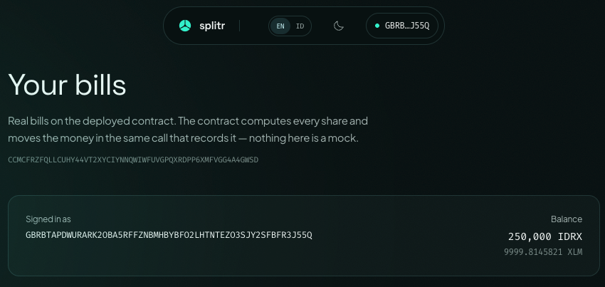
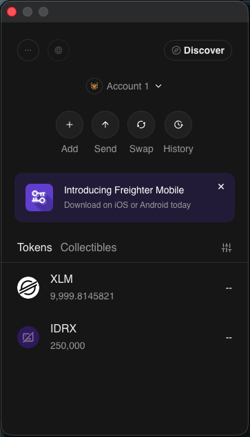

# Splitr

Stablecoin bill splitting on Stellar. This repo covers **White Belt (Level 1)** through
**Green Belt (Level 4)** of the [product brief](context/Splitr%20Product%20Idea%20Brief.pdf):
wallets and real on-chain transactions, then a Soroban contract with multi-wallet browser
signing and live event synchronisation, a working mini dApp at `/app`, and members who
onboard holding no XLM at all.

It is not a throwaway demo — it is the settlement substrate every later belt sits on. The
brief's core promise ("ending disputes over who has paid") is implemented literally:
`split reconcile` rebuilds who-paid-what **from the ledger**, never from a local flag.

## Requirements

Node 24+ (runs TypeScript natively — no build step). Then:

```bash
npm install
export SPLITR_PASSPHRASE=dev-testnet-passphrase   # unlocks wallet secrets; prompts if unset
```

## The full loop

```bash
node src/cli.ts asset init                        # settlement asset + issuer account
node src/cli.ts wallet create alice               # ...repeat for bob, citra
node src/cli.ts wallet fund alice                 # Friendbot creates the account on-chain
node src/cli.ts wallet trust alice                # trustline to IDRX (costs 0.5 XLM reserve)
node src/cli.ts asset issue --to bob --amount 500000

node src/cli.ts split create --group "Dinner Sudirman" \
  --payer alice --amount 300000 --members alice,bob,citra
node src/cli.ts split settle <id>
node src/cli.ts split reconcile <id>
```

`node src/cli.ts help` lists every command.

Verified end-to-end on testnet: a 300,000 IDRX dinner split three ways, settled by two real
payments, reconciled from ledger history. Balances cross-check exactly against every transfer.

## The contract (Yellow Belt)

`soroban/contracts/splitr-split` is the same bill, recorded on-chain. Deployed to testnet at
[`CCMCFRZFQLLCUHY44VT2XYCIYNNQWIWFUVGPQXRDPP6XMFVGG4A4GWSD`](https://stellar.expert/explorer/testnet/contract/CCMCFRZFQLLCUHY44VT2XYCIYNNQWIWFUVGPQXRDPP6XMFVGG4A4GWSD).

```bash
npm run contract:test          # 16 tests
npm run contract:build         # 12.5 KB wasm, 7 exported functions
node src/cli.ts bill create --group "Nasi Padang" --payer alice \
  --amount 300000 --members alice,bob,citra
node src/cli.ts bill settle 1 --member bob            # or --amount 10000 for part of it
node src/cli.ts bill mine bob                        # bills this member is on
node src/cli.ts bill show 1
node src/cli.ts bill watch      # follow contract events as ledgers close
```

`cargo` must be on your PATH for the contract scripts. With Homebrew's rustup it is not by
default — the shims live in `$(brew --prefix rustup)/bin`.

**Why both `split` and `bill`.** `split` settles with classic payments and rebuilds the truth
afterwards by replaying Horizon; it needs no contract and works with any wallet on the network.
`bill` hands the arithmetic to the contract, which computes the shares itself and moves the asset
inside the same invocation that records the payment. There is nothing to reconcile because
nothing can disagree. The contract settles through the asset's Stellar Asset Contract, so both
paths move the same IDRX: after two members settled bill #1 on-chain, `wallet balance` showed
alice up exactly 200,000 and the two payers down exactly 100,000 each.

The splitting algorithm exists twice — `splitByWeights` in `src/money.ts` and
`split_by_weights` in `lib.rs` — and `test::agrees_with_money_ts` pins the cases both must
produce, tie-break included. Changing one without the other is the easiest way to break this repo.

### Two things the dApp needed from the contract

**`bills_for(address)`.** Without an index of which bills an address is on, "my bills" means
reading every bill in the contract and filtering client-side — one round trip per bill, every
time anyone opens the app. `create_bill` now appends the id to each member's list.

**`settle_part(id, member, amount)`.** Paying half now and half later is the ordinary case, not
an edge case; `owes`/`paid` always supported it and only `settle` insisted on closing the whole
gap at once. `settle` now delegates to it, and a test asserts both paths refuse for the same
reasons so the same mistake cannot report two different errors. Overpayment is refused rather
than clamped, because silently taking less than asked for makes the returned amount disagree
with what the caller meant.

### Events

The contract publishes `Created` and `Settled` through `#[contractevent]`, which puts them in
the contract's SEP-48 spec. That is what lets `bill watch` decode them with
`spec.parseEvent` — field names come from the deployed wasm, not from a copy of them kept in
TypeScript. `id` is an indexed topic, so an indexer can follow one bill.

Soroban RPC has no subscription, so `watch` polls `getEvents` on a cursor at the testnet ledger
cadence of five seconds. The cursor makes it resumable and lossless across restarts, and a failed
poll backs off and retries from the same cursor rather than killing the watcher.

## Landing page

`web/` is the marketing site — a Vite + React + Tailwind single page, built from the PRD in
`context/Splitr-PRD.md`.

```bash
npm run web:dev         # http://localhost:5173
npm run web:build       # static output in web/dist
npm run web:typecheck
```

The hero calculator is not a mock-up: it imports `splitByWeights` from `src/money.ts`, the same
largest-remainder function `split create` uses to build on-chain shares. Split 100,000 three ways
on the page and you get `33333.3333334 / 33333.3333333 / 33333.3333333` — identical to the CLI,
because it is the CLI's code.

The root `tsconfig.json` still covers only `src/**/*.ts`; the web app has its own under `web/`, so
`npm run typecheck` checks exactly what it always did.

### Connecting a wallet

The CLI holds keys. The page does not and must not — custody is this project's unresolved
regulatory exposure, and a site that asks for a secret key is the wrong answer to it. Visitors
bring their own wallet through [Stellar Wallets Kit](https://github.com/Creit-Tech/Stellar-Wallets-Kit):
Freighter, xBull, Albedo, Lobstr, Hana, Rabet. "Install Freighter" is a real drop-off for someone
who already uses Lobstr on their phone.

The kit and its modules are 209 KB — 73% on top of everything else the page ships — so they are
behind a dynamic import. A visitor who reads the page and never connects downloads none of it;
the main bundle carries about 2.5 KB of wallet code. The choice is remembered in
`localStorage['splitr-wallet']` and restored with `getAddress`, which reads the kit's memory
rather than prompting, so returning without an authorised origin raises no popup.

### Theming

Colour lives entirely in the token blocks at the top of `web/src/styles.css` — a shadcn-style
`:root` / `.dark` pair mapped into Tailwind through `@theme inline`. No component holds a hex
value. Light and dark both ship; the toggle sits in the nav, remembers the choice in
`localStorage['splitr-theme']`, and falls back to `prefers-color-scheme` for first-time visitors.
A blocking script in `web/index.html` stamps the class before first paint so there is no flash.

### Languages

Every visible string lives in `web/src/lib/copy.ts`, in English and Indonesian. The English object
is the schema and the Indonesian one is typed against it, so a missing key fails the build instead
of leaving a blank on the page. The toggle sits in the nav, remembers the choice in
`localStorage['splitr-lang']`, and falls back to `navigator.language`, so an Indonesian visitor
lands on Indonesian without touching anything. Switching also updates `<html lang>`, the document
title, and the meta description.

The Indonesian is written rather than translated: a treasurer says "nalangin", not "menalangi
terlebih dahulu". Terms this audience already uses in English (on-chain, stablecoin, testnet,
wallet, memo, ledger) are left alone.

Two things follow from the language and are handled in `web/src/lib/split.ts`: thousands group with
dots and decimals with a comma in Indonesian, and the hero headline gets a lower size ceiling
because the same sentence runs longer and the headline has a hard two-line budget. The 7-decimal
ledger value stays canonical in both languages, because that is the string that goes on chain.

### The protocol stack section

`web/src/sections/Stack.tsx` maps the five Stellar layers to their role in Splitr. It is drawn as a
stack rather than set as a table, because the one thing worth seeing is how much of it actually
runs: a live layer gets a filled card, a solid rail and a solid border, a planned one gets a dashed
outline and no fill.

Four of the five are live, and the section says so. The CLI calls Horizon, `Asset`, `Memo` and
`payment`, and since Yellow Belt it also calls a deployed Soroban contract through
`src/soroban.ts`, so the smart-contract layer is marked live. Only the SEP-24 ramp is still
planned, and it stays planned until a real IDR anchor exists. The asset layer names IDRX rather
than USDC because IDRX is what this repo actually issues.

### The how-it-works carousel

`web/src/sections/HowItWorks.tsx` puts the three steps on a real horizontal track rather than
crossfading them in place. A track gets the direction right for free: advancing pushes the outgoing
slide left and pulls the incoming one in from the right, going back reverses it, and there is no
direction state to get wrong. It also holds the height of its tallest slide, so nothing jumps.

Two motions, both doing a job. The 650ms slide says which way you moved. The two comparison cards
then rise with a 260ms and 360ms delay, so the claim lands after the picture has settled rather
than competing with it. Off-screen slides carry `inert`, so nothing hidden is reachable by keyboard.
The global `prefers-reduced-motion` block in `styles.css` collapses all of it to an instant cut.

### Imagery

Four illustrations, drawn in the brand palette and set in Indonesia: an arisan in the bento, and
one per step of the how-it-works carousel.

The originals live in `web/img/` at roughly 2750x1536 and 6 MB each. **Those are sources, not
assets.** What ships is `web/img/opt/*.webp`: resized to 1400px wide and encoded at q82, which
takes all four from 24 MB to 416 KB with no visible loss at the size they render. Regenerate after
replacing an original:

```bash
cd web/img
sips --resampleWidth 1400 name.png --out /tmp/name.png
cwebp -q 82 -m 6 /tmp/name.png -o opt/name.webp     # brew install webp
```

Import the `opt/` file, never the PNG. Vite inlines whatever it is given, so importing a source
would put 6 MB into the bundle.

Stock photography was tried first and rejected: a seeded placeholder service returned a pine forest
for the "friends splitting a bill" tile, which reads worse than an honest gap.

Two deliberate deviations from the supplied token set, both marked in the file: `--muted-foreground`
is darkened in light mode (the supplied value measured 3.94:1 on `--background`, under AA for body
copy), and `--faint` is added as a third text tier for 10–13px metadata. Measured ratios are
4.58–5.44:1 in light and 5.68–9.66:1 in dark.

## The app (Orange Belt)

`/app` is the dApp: connect a wallet, record a bill, pay a share or part of one, and watch the
contract as ledgers close. Same contract as the CLI, same asset, same balances — the difference
is only who holds the key.

```bash
npm run web:dev     # http://localhost:5173/app
```

Two pages, so `web/src/lib/useRoute.ts` is two lines of routing rather than a router. Path-based
rather than hash-based, because the landing page already uses `#how`, `#demo` and `#faq` to
scroll and a hash router would fight them for the same slot. The cost is that a static host has
to rewrite unknown paths to `index.html`; `web/public/_redirects` does that for Netlify, and
Vite's dev server does it already.

Everything the app needs — `@stellar/stellar-sdk` and the wallet kit — is behind a dynamic
import, because the SDK alone is larger than the whole landing page. The entry chunk is 288 KB
and a visitor who only reads the marketing copy downloads none of the chain code. Check it after
touching the app: `npm run web:build` should keep `index-*.js` near that number, with `utils-*`
(the SDK) and `client-*` as separate chunks.

## Arriving with nothing (Green Belt)

Stellar charges every account a reserve: 1 XLM to exist, 0.5 more per trustline. That was this
project's largest practical obstacle, and the earlier README said so — a treasurer cannot tell
four friends to go buy XLM before anyone can be paid back in Rupiah.

```bash
node src/cli.ts wallet onboard dina --sponsor issuer
node src/cli.ts split settle <id> --member dina --fee-source issuer
```

`wallet onboard` creates the account and its trustline inside a
`beginSponsoringFutureReserves` / `endSponsoringFutureReserves` sandwich, which is the only way
`createAccount` may start at zero. All four operations ride in one transaction because they are
one decision, and it carries two signatures: the sponsor's, and the sponsored account's, because
Stellar requires the sponsored party to agree to both ends of the sandwich.

That gets a member on-chain, but not transacting — a zero-XLM account still cannot pay a fee.
`--fee-source` wraps the settlement in a **fee-bump**, so someone else bids the fee while the
payment itself is still signed by, and debited from, the member.

Verified on testnet. `dina` was onboarded, received 50,000 IDRX, and settled a 20,000 share:

```
dina: SKIPPED — Transaction rejected: tx_insufficient_balance   # without --fee-source
dina → alice  20,000 IDRX                                        # with it
```

Her XLM balance before and after both read `0`. Horizon reports `num_sponsored: 3` against her
account and names the issuer as sponsor of both the account and the trustline.

**A reserve bug this surfaced.** `snapshot()` computed the minimum balance as
`(2 + subentries) * baseReserve`, which ignores sponsorship. It told a member holding zero XLM
that their floor was 1.5 — the exact thing sponsorship removes — and understated the sponsor's.
The formula is `(2 + subentries + numSponsoring - numSponsored) * baseReserve`; `dina` now reads
a floor of 0 and the issuer 2.5.

### Reaching the app with no XLM

Sponsored reserves put a member on-chain owning nothing, but a zero-XLM account
still cannot pay a transaction fee — and Stellar's answer, a fee-bump, has to be
signed by the *sponsor*. That key cannot live in a browser, so `api/relay.ts` is
the one piece of Splitr that runs on a server: the member signs the call, the
relay wraps it in a fee-bump and submits.

It is not a general relay. It signs only for a single-operation transaction that
invokes this project's contract, and caps the fee at 0.1 XLM. Without both
checks it is a faucet that drains the sponsor for anyone who finds the URL. Set
`SPLITR_SPONSOR_SECRET` in the deployment environment; with it unset the
endpoint returns 503 and the app simply asks people to fund their own account.

The app only takes this route when the connected account holds less than 0.5
XLM. Everyone else pays their own fee, which is cheaper for the sponsor and one
less moving part.

## Screenshots

Taken against Stellar testnet with a real browser wallet. Every figure below is
live state read back from the chain, not a mock-up — the contract id in the app
header is
[`CCMCFRZ…GWSD`](https://stellar.expert/explorer/testnet/contract/CCMCFRZFQLLCUHY44VT2XYCIYNNQWIWFUVGPQXRDPP6XMFVGG4A4GWSD)
and every transaction hash resolves on a public explorer.

### Wallet connected



The address sits in the nav rather than a "Connected" badge, because the useful
question is *which* account: several of these wallets hold more than one, and
paying from the wrong one is the mistake worth designing against.

### Balance displayed



IDRX is the settlement asset; XLM is shown underneath because it pays the fees.
Balances come from Horizon — an account's trustlines are classic ledger state,
which Soroban RPC does not serve.

### A settlement on testnet


Settling calls the contract, which transfers through the asset's Stellar Asset
Contract in the same invocation that records the payment. The transfer and the
record cannot disagree, because either both happened or neither did.

### The result, shown to the user


The hash is a link. A confirmation without one asks to be taken on trust, which
is the habit this project exists to replace — the whole promise is that the
proof does not depend on trusting Splitr.

## Deploying

The site is a static bundle with no server and no secrets — the contract ids in
it are public by design. The one thing a host has to get right is serving
`index.html` for unknown paths, because `/app` is a client-side route and a
refresh there would otherwise 404.

The build does not live at the repo root, which trips up framework
auto-detection: left to itself, Vercel runs a bare `vite build` from the root
and fails with `UNRESOLVED_ENTRY — Cannot resolve entry module index.html`,
because `index.html` is in `web/`. `vercel.json` pins the real build:

```
Build command      npm run web:build
Output directory   web/dist
```

Netlify and Cloudflare Pages need the same two settings, and read the SPA
fallback from `web/public/_redirects`; Vercel ignores that file, so the rewrite
is in `vercel.json` instead. GitHub Pages is the awkward one — no SPA fallback,
and a project page is served from a `/<repo>` subpath that breaks the `/app`
route.

`.vercelignore` keeps the 24 MB of illustration sources in `web/img/*.png` out
of the upload. Only `web/img/opt/*.webp` is imported, so the originals are
weight on every deploy and nothing else.

## How the White Belt primitives map to the product

| Stellar primitive  | Splitr's version                                    |
| ------------------ | --------------------------------------------------- |
| `Keypair.random()` | onboarding a group member                           |
| Friendbot funding  | testnet stand-in for an IDR on-ramp                 |
| Account balances   | "can this member settle their share?"               |
| `changeTrust`      | accepting the group's settlement currency           |
| `payment` + memo   | **settling one share of a split**                   |
| Payment history    | proof-of-payment replacing "already transferred 🙏" |

## Design decisions worth knowing

**Own test asset, not testnet USDC.** Testnet carries 200+ unrelated `USDC` issuers, none with
a verifiable home domain. Splitr issues `IDRX`, an IDR-pegged test token — reproducible, and
closer to the brief's Rupiah story. Point at any real asset with `SPLITR_ASSET_CODE` /
`SPLITR_ASSET_ISSUER`.

**Integer money.** All arithmetic runs in units of 1e-7 (Stellar's precision) via `BigInt`, with
a largest-remainder split. Shares always sum back to the total exactly — a 100,000 bill across
3 people yields `33333.3333334 / 33333.3333333 / 33333.3333333`, never a lost stroop.

**Memo as the join key.** Every settlement carries `splitr:<id>` as a `MemoText`. That is what
lets reconciliation attribute a payment to a specific bill, and it's why two concurrent splits
between the same people don't contaminate each other.

**Ledger is the source of truth.** `split settle` reconciles before paying, so it is idempotent:
run it twice and the second run pays nothing. Partial payments show as `OPEN … short N`.

**Dynamic fees.** Testnet surge-prices well above the 100-stroop base fee. Splitr bids
`p90 × 2`, capped at 0.01 XLM. Stellar charges the market-clearing rate, not your bid.

**Secrets encrypted at rest.** AES-256-GCM under a scrypt-stretched passphrase in `.splitr/`
(gitignored). Testnet keys are disposable; the habit is not.

## Carried forward to the next belts

- ~~**Reserves are the onboarding wall.**~~ Done at Green Belt: `wallet onboard` sponsors the
  account and its trustline, and `--fee-source` fee-bumps the settlement, so a member arrives and
  transacts holding zero XLM.
- ~~**Custody is unspecified in the brief.**~~ Settled at Yellow Belt for the web: the page is
  non-custodial through Stellar Wallets Kit and never sees a secret key. The CLI still holds keys,
  which is correct for an operator tool and wrong for anything a member touches.
- **The relay is deployed but unproven.** `api/relay.ts` typechecks and its guard logic is
  straightforward, but no request has ever reached it — verifying that needs a deployment with
  `SPLITR_SPONSOR_SECRET` set and an account genuinely holding zero XLM.
- **The relay has no rate limiting.** One capped fee per call, but nothing stops a caller making
  many. Fine for testnet; not fine anywhere near real funds.
- **Sponsorship is never revoked.** Nothing calls `revokeSponsorship`, so a sponsor's reserve is
  locked for as long as the member exists. Fine at four members, not at Blue Belt's fifty.
- **Black Belt's 20+ mainnet users are gated on a real IDR anchor**, which the brief defers to
  "future." That remains the project's largest unstated risk.
