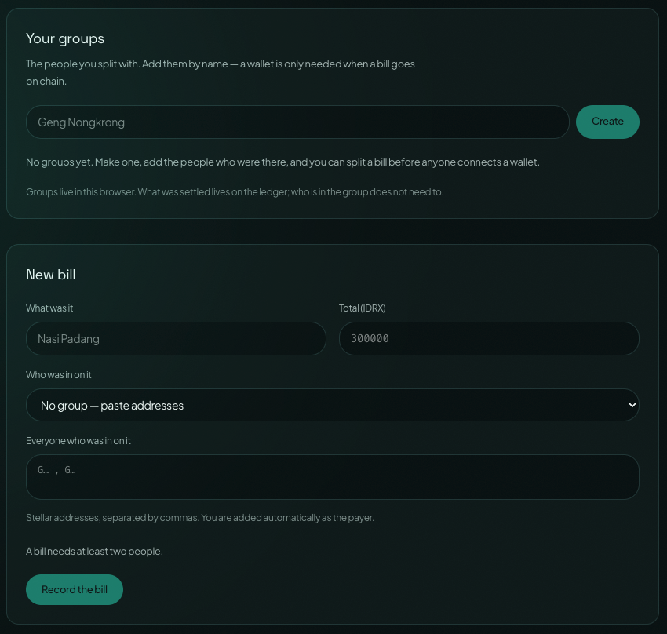
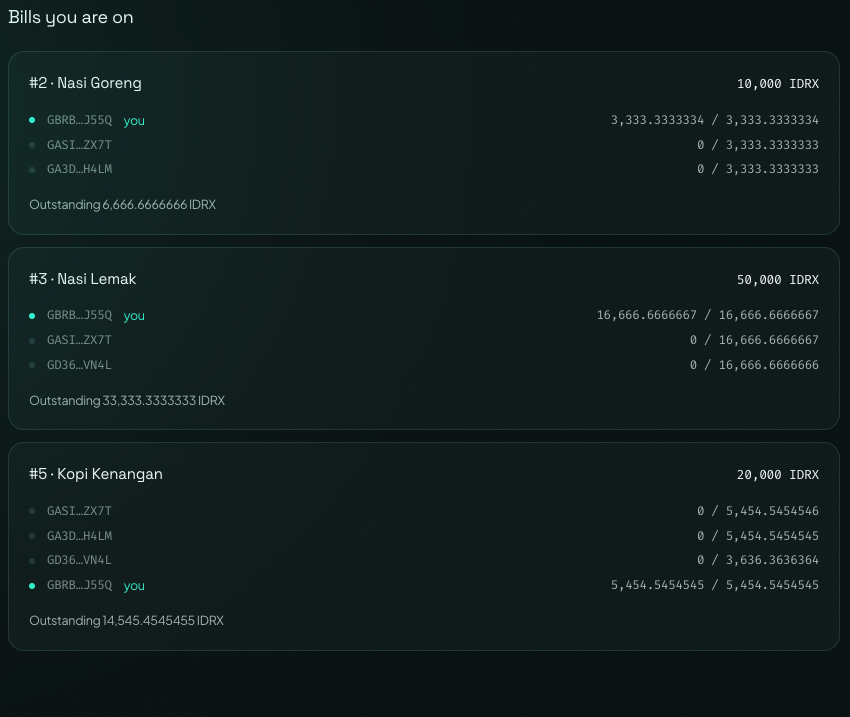
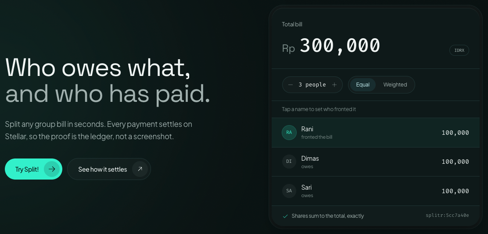

# Splitr

**Stablecoin bill splitting on Stellar.** Split a bill with friends, settle in a
Rupiah-pegged token, and prove who paid from the ledger instead of a screenshot.

- **Repository:** https://github.com/yazidalg/splitr
- **Contract (testnet):** [`CCMCFRZFQLLCUHY44VT2XYCIYNNQWIWFUVGPQXRDPP6XMFVGG4A4GWSD`](https://stellar.expert/explorer/testnet/contract/CCMCFRZFQLLCUHY44VT2XYCIYNNQWIWFUVGPQXRDPP6XMFVGG4A4GWSD)
- **Network:** Stellar testnet
- **Demo video:** _to add_

### Contract interactions on testnet

Both resolve on a public explorer as `invoke_host_function` against the contract
above. Bill #6, recorded and settled in full:

| What | Transaction |
| ----------------------------------- | ----------------------------------------------------------- |
| `create_bill` — 30,000 IDRX, 3 ways | [`f7026078…cec5f310`](https://stellar.expert/explorer/testnet/tx/f70260783286ecefae5365404d677af4e514dd2df83e358114415015cec5f310) |
| `settle_part` — the last share | [`e6d52e7f…dc9a62a4`](https://stellar.expert/explorer/testnet/tx/e6d52e7f1575e6606cd5996bc620282b3127d6d3e53e16e976af5d64dc9a62a4) |

The contract computed the three shares itself; the CLI only passed the total and
the members. The settlement moved IDRX through the asset's Stellar Asset Contract
in the same invocation that recorded it, which is why there is one hash and not
two.

---

## What Splitr is

Someone fronts the bill for dinner, and then spends a week chasing four people
for their share. The transfers arrive in different apps, at different times, and
the only record that anyone paid is a screenshot in a group chat — which proves
nothing and can be edited.

Splitr replaces that record with the ledger. A bill is recorded on chain, each
member's share is computed by the contract, and settling a share moves the money
and writes the record in the **same transaction**. There is no "mark as paid"
button, because there is no state that could disagree with what actually moved.

### What it does

- **Computes the split.** Even or weighted, using a largest-remainder algorithm
  in integer units of 1e-7 — Stellar's own precision. Shares always sum back to
  the total exactly; a 100,000 bill across three people yields
  `33333.3333334 / 33333.3333333 / 33333.3333333`, never a lost stroop.
- **Records the bill on chain.** A Soroban contract stores the bill and its
  shares, and computes the shares itself rather than trusting the numbers the
  creator typed.
- **Settles atomically.** Payment moves through the asset's Stellar Asset
  Contract inside the invocation that records it.
- **Proves payment from history.** The classic path (`split`) carries a
  `splitr:<id>` memo on every payment and rebuilds who-paid-what by replaying
  Horizon, so settling twice pays nothing the second time.
- **Onboards members holding zero XLM.** Sponsored reserves create the account
  and its trustline; a fee relay bumps the fee so a member with an empty wallet
  can still transact.
- **Speaks Indonesian and English**, with number formatting to match.

### What is built

The [product brief](context/Splitr%20Product%20Idea%20Brief.pdf) stages the
project in belts. This repository covers Level 1 through Level 4:

| Level | Belt | What it added |
| ----- | ------ | ------------------------------------------------------------------ |
| 1 | White | Wallets, an issued settlement asset, real on-chain payments, ledger reconciliation |
| 2 | Yellow | The Soroban contract, deployed to testnet, plus browser wallet connection |
| 3 | Orange | The mini dApp at `/app`: partial settlement, per-member bill index, live events |
| 4 | Green | Sponsored onboarding and a fee relay, so a member with no XLM can use the app |

### The stack

| Path | What it is | Toolchain |
| ---------- | ----------------------------------------------------- | ------------------------------------ |
| `src/` | The CLI — wallets, asset, splits, contract-backed bills | Node 24+ running TypeScript natively |
| `web/` | Landing page (`/`) and the dApp (`/app`) | Vite 8 + React 19 + Tailwind 4 |
| `soroban/` | The on-chain split contract, in Rust | Cargo + the `stellar` CLI |
| `api/` | The fee relay — the only piece that runs on a server | Vercel serverless function |

Everything runs against **Stellar testnet**. The settlement asset is `IDRX`, an
IDR-pegged test token this repo issues itself.

---

## Running it locally

### Requirements

- **Node 24 or newer** — it executes the TypeScript in `src/` directly, so there
  is no build step.
- **Rust and the `stellar` CLI** — only if you want to build or test the
  contract. The deployed contract works without them.

### Install

```bash
git clone https://github.com/yazidalg/splitr.git
cd splitr
npm install
```

One environment variable unlocks the encrypted wallet secrets. Set it, or the
CLI will prompt for it:

```bash
export SPLITR_PASSPHRASE=dev-testnet-passphrase
```

### 1. The web app

```bash
npm run web:dev
```

- Landing page: http://localhost:5173
- The dApp: http://localhost:5173/app

Open `/app`, connect a wallet (Freighter, xBull, Albedo, Lobstr, Hana or Rabet),
and you are talking to the contract already deployed on testnet. The page never
sees a secret key.

To get a testnet account funded and holding IDRX, run the CLI loop below and
issue to your browser wallet's address.

### 2. The CLI — the full loop

```bash
node src/cli.ts asset init                        # settlement asset + issuer account
node src/cli.ts wallet create alice               # ...repeat for bob, citra
node src/cli.ts wallet fund alice                 # Friendbot creates the account on-chain
node src/cli.ts wallet trust alice                # trustline to IDRX (costs 0.5 XLM reserve)
node src/cli.ts asset issue --to bob --amount 500000

node src/cli.ts split create --group "Dinner Sudirman" \
  --payer alice --amount 300000 --members alice,bob,citra
node src/cli.ts split settle <id>
node src/cli.ts split reconcile <id>
```

The same bill, recorded on the contract instead:

```bash
node src/cli.ts bill create --group "Nasi Padang" --payer alice \
  --amount 300000 --members alice,bob,citra
node src/cli.ts bill settle 1 --member bob            # or --amount 10000 for part of it
node src/cli.ts bill mine bob                         # bills this member is on
node src/cli.ts bill show 1
node src/cli.ts bill watch                            # follow contract events as ledgers close
```

A member who owns nothing at all:

```bash
node src/cli.ts wallet onboard dina --sponsor issuer
node src/cli.ts split settle <id> --member dina --fee-source issuer
node src/cli.ts wallet unsponsor dina --sponsor issuer   # once dina can carry it
```

`node src/cli.ts help` lists every command.

### 3. The contract

`cargo` must be on your PATH. With Homebrew's rustup it is not by default — the
shims live in `$(brew --prefix rustup)/bin`:

```bash
export PATH="/opt/homebrew/opt/rustup/bin:$PATH"

npm run contract:test          # 16 tests
npm run contract:build         # 12.5 KB wasm, 7 exported functions
npm run contract:deploy        # needs the `splitr-deployer` stellar identity
```

Redeploying mints a new contract address; record it in `soroban/deployments.json`.

### Checks

There is no lint config. These four commands are the entire automated gate, and
CI runs all of them on every push:

```bash
npm run typecheck        # tsc over src/, api/, scripts/
npm run web:typecheck    # tsc over web/
npm test                 # the split engine against the contract's own cases
npm run contract:test    # cargo test — 16 tests
```

CI additionally builds the site and fails if the entry chunk grows past 340 KB —
that catches a static import of the Stellar SDK or the wallet kit creeping into
the landing page, which no typecheck would notice.

### Environment variables

All optional. Defaults point at testnet and at the deployed contract.

| Variable | Default | Purpose |
| ----------------------- | ---------------------------------- | ------------------------------------- |
| `SPLITR_PASSPHRASE` | prompts | Decrypts wallet secrets in `.splitr/` |
| `SPLITR_HOME` | `./.splitr` | Where wallets and asset config live |
| `SPLITR_HORIZON` | `https://horizon-testnet.stellar.org` | Horizon endpoint |
| `SPLITR_RPC` | `https://soroban-testnet.stellar.org` | Soroban RPC endpoint |
| `SPLITR_NETWORK_PASSPHRASE` | testnet | Network to sign for |
| `SPLITR_CONTRACT_ID` | from `soroban/deployments.json` | Override the split contract |
| `SPLITR_ASSET_CODE` / `SPLITR_ASSET_ISSUER` | issues `IDRX` locally | Point at an existing asset instead |
| `SPLITR_SPONSOR_SECRET` | unset (relay returns 503) | Server-side key that pays relayed fees |

---

## Screenshots

Taken against Stellar testnet with a real browser wallet. Every figure is live
state read back from the chain, not a mock-up — the contract id in the app header
is [`CCMCFRZ…GWSD`](https://stellar.expert/explorer/testnet/contract/CCMCFRZFQLLCUHY44VT2XYCIYNNQWIWFUVGPQXRDPP6XMFVGG4A4GWSD)
and every transaction hash resolves on a public explorer.

### Wallet connected


The address sits in the nav rather than a "Connected" badge, because the useful
question is *which* account: several of these wallets hold more than one, and
paying from the wrong one is the mistake worth designing against. The contract id
under the heading is the deployed contract every figure on this page comes from.

### Balance displayed


The same two figures the account panel reads in the screenshot above —
`250,000 IDRX` and `9999.8145821 XLM` — shown by the wallet itself. IDRX is the
settlement asset; XLM is what pays the fees. The app takes them from Horizon,
because an account's trustlines are classic ledger state, which Soroban RPC does
not serve.

### Recording a bill



A bill needs at least two people, and the connected account is added as the payer
automatically. Groups live in the browser and members can be added by name — a
wallet is only needed at the moment a bill goes on chain.

### A successful testnet transaction



Bills read back off the contract after settling. On `#2 · Nasi Goreng` the
connected account shows `3,333.3333334 / 3,333.3333334` — its share paid in full,
and the odd stroop that the largest-remainder split hands to the first member.
Outstanding is what the group still owes the payer.

Settling calls the contract, which transfers through the asset's Stellar Asset
Contract in the same invocation that records the payment. The transfer and the
record cannot disagree, because either both happened or neither did — which is
why this view needs no reconciliation step behind it.

### The transaction result, shown to the user

> **To capture:** settle a share from `/app` and screenshot the receipt panel that
> appears — the summary line, the transaction hash, and its link to
> stellar.expert. Save it as `docs/screenshots/05-transaction-result.png` and add
> the image here.

The hash is a link. A confirmation without one asks to be taken on trust, which
is the habit this project exists to replace — the whole promise is that the proof
does not depend on trusting Splitr.

### Mobile

> **To capture:** open `/app` at a phone width (375px in devtools, or a real
> phone) with a wallet connected and a bill on screen. Save it as
> `docs/screenshots/06-mobile.png` and add the image here.

The layout is responsive by wrapping rather than by breakpoints: the rows that
carry an address and a figure are `flex-wrap`, and the 56-character addresses
carry `break-all` so they fold instead of pushing the card wide. That is why
there are only two `sm:` utilities in the whole dApp — the narrow case is the
default one, not a special case bolted on afterwards.

### The tests

> **To capture:** run `npm test` and screenshot the terminal. Save it as
> `docs/screenshots/07-tests.png` and add the image here.

```
$ npm test

✔ agrees with the contract, case for case
✔ parts always sum back to the total
✔ heavier weights never receive less than lighter ones
✔ a single call to the Splitr contract is accepted
✔ anything but one call to the Splitr contract is refused
✔ only an account that cannot pay its own fee is relayed for
✔ the sponsor stops at its floor, not at empty
✔ an account gets one relayed call per cooldown
✔ the limiter forgets accounts once their cooldown passes
✔ an onboarded member has both entries to hand back
✔ a member holding nothing cannot take their reserve back
✔ a member who has funded themselves can
✔ a stroop short is still short
✔ only the entries this sponsor pays for are revoked
✔ a sponsor with nothing to release is told so, not sent to the network
✔ an account that never made it on chain is refused first
✔ a member who sponsors someone else keeps carrying that
ℹ tests 17
ℹ pass 17
ℹ fail 0
```

Seventeen here, plus 16 in `cargo test` for the contract. They are not a
formality: four of them exist because they caught something. The parity cases
catch a change to the splitting engine on either side, and the sponsorship
fixture was rewritten after a live account disagreed with it.

### The landing page



The calculator is not a mock-up. It imports `splitByWeights` from `src/money.ts`,
the same function the CLI and the contract mirror, so "shares sum to the total,
exactly" is the computation itself rather than a claim about it.

---

## How it works

Everything below is the reasoning behind the decisions above. It is here so that
changing one of them is a deliberate act rather than an accident.

### Why there are two settlement paths

`split` settles with classic payments and rebuilds the truth afterwards by
replaying Horizon; it needs no contract and works with any wallet on the network.
`bill` hands the arithmetic to the contract, which computes the shares itself and
moves the asset inside the same invocation that records the payment. There is
nothing to reconcile because nothing can disagree.

The contract settles through the asset's Stellar Asset Contract, so both paths
move the same IDRX: after two members settled bill #1 on-chain, `wallet balance`
showed alice up exactly 200,000 and the two payers down exactly 100,000 each.

Verified end-to-end on testnet: a 300,000 IDRX dinner split three ways, settled
by two real payments, reconciled from ledger history. Balances cross-check
exactly against every transfer.

### The splitting algorithm exists twice

`splitByWeights` in `src/money.ts` (`BigInt`) and `split_by_weights` in
`soroban/contracts/splitr-split/src/lib.rs` (`i128`) are the same largest-remainder
algorithm, tie-break by index included. **Changing one without the other is the
easiest way to break this repo**, so the same cases are asserted from both ends:
`test::agrees_with_money_ts` runs them through the contract, `scripts/parity.ts`
runs them through the TypeScript engine, and each is a separate CI job.

Both halves are needed because neither catches the other's drift. `cargo test`
never learns that TypeScript changed, and `tsc` checks types, not values — flip
the tie-break in `money.ts` from ascending to descending index and the typecheck
stays green while the odd stroop silently moves to a different member. The
landing page's preview runs the TypeScript engine and the chain runs the Rust
one; if they disagree, the page is telling people something the contract will not
honour.

`src/money.ts` is also imported directly by the landing page's hero calculator,
so it must stay dependency-free and browser-safe. Split 100,000 three ways on the
page and you get the CLI's exact output, because it is the CLI's code.

### Two things the dApp needed from the contract

**`bills_for(address)`.** Without an index of which bills an address is on, "my
bills" means reading every bill in the contract and filtering client-side — one
round trip per bill, every time anyone opens the app. `create_bill` now appends
the id to each member's list.

**`settle_part(id, member, amount)`.** Paying half now and half later is the
ordinary case, not an edge case; `owes`/`paid` always supported it and only
`settle` insisted on closing the whole gap at once. `settle` now delegates to it,
and a test asserts both paths refuse for the same reasons so the same mistake
cannot report two different errors. Overpayment is refused rather than clamped,
because silently taking less than asked for makes the returned amount disagree
with what the caller meant.

### Events

The contract publishes `Created` and `Settled` through `#[contractevent]`, which
puts them in the contract's SEP-48 spec. That is what lets `bill watch` decode
them with `spec.parseEvent` — field names come from the deployed wasm, not from a
copy of them kept in TypeScript. `id` is an indexed topic, so an indexer can
follow one bill.

Soroban RPC has no subscription, so `watch` polls `getEvents` on a cursor at the
testnet ledger cadence of five seconds. The cursor makes it resumable and
lossless across restarts, and a failed poll backs off and retries from the same
cursor rather than killing the watcher.

### Arriving with nothing

Stellar charges every account a reserve: 1 XLM to exist, 0.5 more per trustline.
That was this project's largest practical obstacle — a treasurer cannot tell four
friends to go buy XLM before anyone can be paid back in Rupiah.

`wallet onboard` creates the account and its trustline inside a
`beginSponsoringFutureReserves` / `endSponsoringFutureReserves` sandwich, which is
the only way `createAccount` may start at zero. All four operations ride in one
transaction because they are one decision, and it carries two signatures: the
sponsor's, and the sponsored account's, because Stellar requires the sponsored
party to agree to both ends of the sandwich.

That gets a member on-chain, but not transacting — a zero-XLM account still cannot
pay a fee. `--fee-source` wraps the settlement in a **fee-bump**, so someone else
bids the fee while the payment itself is still signed by, and debited from, the
member.

Verified on testnet. `dina` was onboarded, received 50,000 IDRX, and settled a
20,000 share:

```
dina: SKIPPED — Transaction rejected: tx_insufficient_balance   # without --fee-source
dina → alice  20,000 IDRX                                       # with it
```

Her XLM balance before and after both read `0`. Horizon reports `num_sponsored: 3`
against her account and names the issuer as sponsor of both the account and the
trustline.

**A reserve bug this surfaced.** `snapshot()` computed the minimum balance as
`(2 + subentries) * baseReserve`, which ignores sponsorship. It told a member
holding zero XLM that their floor was 1.5 — the exact thing sponsorship removes —
and understated the sponsor's. The formula is
`(2 + subentries + numSponsoring - numSponsored) * baseReserve`; `dina` now reads
a floor of 0 and the issuer 2.5.

### Giving the reserve back

Reserves went out and never came back, which made the sponsor's balance a
one-way ratchet — and that account also funds the *next* onboarding, so it was a
ceiling on how many members a group could bring on at all.

```bash
node src/cli.ts wallet unsponsor dina --sponsor issuer
```

Only the sponsor signs, because revocation releases something the sponsor pays
for. But the member's *balance* decides whether it may happen: a revoked reserve
falls back onto the account holding the entry, so a member still holding zero
cannot take theirs back — the network would refuse the whole transaction.
Sponsorship is not a loan callable at will; it is released once the member can
carry it. `src/sponsorship.ts` says so before anything is signed, and names the
account to top up and by how much, which `op_low_reserve` does not.

Verified on testnet with a throwaway member. Onboarding moved the issuer's floor
from 4 to 5.5 XLM; revoking moved it back to 4 and left the member carrying 1.5
themselves. Horizon then reports `num_sponsored: 0` and no sponsor on either
entry. Run it twice and the second is refused rather than paid for again.

**A units bug this surfaced,** and the live check is what caught it — the unit
tests had agreed with the mistake. `num_sponsored` counts reserve *units*, not
ledger entries, and an account's own entry is worth **two** of them: it is the
`2` in the formula above. An onboarded member therefore reads `num_sponsored: 3`
for two sponsored entries. Counting entries made `wallet unsponsor` report 1 XLM
released instead of 1.5, and tell a treasurer to send 1 XLM when the network was
about to demand 1.5 — a refusal, at the moment they were trying to fix one.

### Reaching the app with no XLM

Sponsored reserves put a member on-chain owning nothing, but Stellar's answer to a
zero-XLM fee — a fee-bump — has to be signed by the *sponsor*. That key cannot
live in a browser, so `api/relay.ts` is the one piece of Splitr that runs on a
server: the member signs the call, the relay wraps it in a fee-bump and submits.

It is not a general relay. It is an endpoint on the public internet that spends
someone else's XLM, so four things have to hold before it signs anything:

| Check | What it stops |
| ------------------------------------------- | ------------------------------------------------ |
| One operation, invoking *this* contract | Paying for arbitrary transactions |
| The caller holds less than 0.5 XLM | Funded accounts helping themselves to a free fee |
| The sponsor is still above its floor | The sponsor being emptied rather than spent down |
| No relayed call for that account in a minute | One account in a loop |

Only the first of those existed at Green Belt, and it was not enough: a valid
invocation, repeated from a funded account, was free money out of the sponsor.
The second is the load-bearing one, because it makes abuse cost an attacker a
genuinely empty account per stream of requests rather than nothing at all. It is
also the check the browser already made on its own machine — `FEE_FLOOR_XLM` in
`web/src/lib/contract.ts` — and an endpoint anyone can post to cannot take that
on trust, so it now reaches the same conclusion from the ledger.

The fee is capped at 0.1 XLM per call on top of all of that. Set
`SPLITR_SPONSOR_SECRET` in the deployment environment; with it unset the endpoint
returns 503 and the app simply asks people to fund their own account.

Every refusal lives in `api/guards.ts`, apart from the I/O, because that is what
makes it testable — `npm test` runs each one. The app only takes this route when
the connected account holds less than 0.5 XLM; everyone else pays their own fee,
which is cheaper for the sponsor and one less moving part.

### The landing page

`web/` is the marketing site, built from the PRD in `context/Splitr-PRD.md`.

**Connecting a wallet.** The CLI holds keys. The page does not and must not —
custody is this project's unresolved regulatory exposure, and a site that asks for
a secret key is the wrong answer to it. Visitors bring their own wallet through
[Stellar Wallets Kit](https://github.com/Creit-Tech/Stellar-Wallets-Kit).
"Install Freighter" is a real drop-off for someone who already uses Lobstr on
their phone.

The kit and its modules are 209 KB — 73% on top of everything else the page ships
— so they are behind a dynamic import. A visitor who reads the page and never
connects downloads none of it. The choice is remembered in
`localStorage['splitr-wallet']` and restored with `getAddress`, which reads the
kit's memory rather than prompting, so returning without an authorised origin
raises no popup.

**Theming.** Colour lives entirely in the token blocks at the top of
`web/src/styles.css` — a shadcn-style `:root` / `.dark` pair mapped into Tailwind
through `@theme inline`. No component holds a hex value. A blocking script in
`web/index.html` stamps the class before first paint so there is no flash.

Two deliberate deviations from the supplied token set, both marked in the file:
`--muted-foreground` is darkened in light mode (the supplied value measured 3.94:1
on `--background`, under AA for body copy), and `--faint` is added as a third text
tier for 10–13px metadata. Measured ratios are 4.58–5.44:1 in light and 5.68–9.66:1
in dark.

**Languages.** Every visible string lives in `web/src/lib/copy.ts`, in English and
Indonesian. The English object is the schema and the Indonesian one is typed
against it, so a missing key fails the build instead of leaving a blank on the
page. The toggle falls back to `navigator.language`, so an Indonesian visitor
lands on Indonesian without touching anything.

The Indonesian is written rather than translated: a treasurer says "nalangin", not
"menalangi terlebih dahulu". Terms this audience already uses in English
(on-chain, stablecoin, testnet, wallet, memo, ledger) are left alone. Thousands
group with dots and decimals with a comma, and the hero headline gets a lower size
ceiling because the same sentence runs longer. The 7-decimal ledger value stays
canonical in both languages, because that is the string that goes on chain.

**The protocol stack section.** `web/src/sections/Stack.tsx` maps the five Stellar
layers to their role in Splitr, drawn as a stack rather than a table because the
one thing worth seeing is how much of it actually runs: a live layer gets a filled
card, a planned one a dashed outline. Four of the five are live. Only the SEP-24
ramp is still planned, and it stays planned until a real IDR anchor exists.

**The how-it-works carousel.** `web/src/sections/HowItWorks.tsx` puts the three
steps on a real horizontal track rather than crossfading them in place. A track
gets the direction right for free, and holds the height of its tallest slide so
nothing jumps. The 650ms slide says which way you moved; the two comparison cards
then rise with a 260ms and 360ms delay, so the claim lands after the picture has
settled. Off-screen slides carry `inert`. The global `prefers-reduced-motion`
block in `styles.css` collapses all of it to an instant cut.

**Imagery.** The originals live in `web/img/` at roughly 2750x1536 and 6 MB each.
**Those are sources, not assets.** What ships is `web/img/opt/*.webp`: resized to
1400px wide at q82, which takes all four from 24 MB to 416 KB with no visible loss.
Regenerate after replacing an original:

```bash
cd web/img
sips --resampleWidth 1400 name.png --out /tmp/name.png
cwebp -q 82 -m 6 /tmp/name.png -o opt/name.webp     # brew install webp
```

Import the `opt/` file, never the PNG — Vite inlines whatever it is given.

### The dApp

Two pages, so `web/src/lib/useRoute.ts` is two lines of routing rather than a
router. Path-based rather than hash-based, because the landing page already uses
`#how`, `#demo` and `#faq` to scroll and a hash router would fight them for the
same slot. The cost is that a static host has to rewrite unknown paths to
`index.html`; `web/public/_redirects` does that for Netlify, `vercel.json` for
Vercel, and Vite's dev server does it already.

Everything the app needs — `@stellar/stellar-sdk` and the wallet kit — is behind a
dynamic import, because the SDK alone is larger than the whole landing page.

**Who is on a bill, and where that lives.** The division is deliberate: *who was
there is a local fact, what was settled is a ledger fact.* Only the second has to
be trustless. Groups and members live in `localStorage`, because the group-then-split
flow has to work before anyone has a wallet — and `create_bill` takes a
`Vec<Address>` that structurally cannot hold such a person. A bill is blocked from
going on chain until every member has an address; recording a subset would silently
change everyone else's share. Names are shown on bill cards **in addition to** the
address, never instead: the address is what the ledger settled with, and a local
nickname must not be able to hide it.

## Deploying

The site is a static bundle with no server and no secrets — the contract ids in it
are public by design. The one thing a host has to get right is serving `index.html`
for unknown paths, because `/app` is a client-side route and a refresh there would
otherwise 404.

The build does not live at the repo root, which trips up framework auto-detection:
left to itself, Vercel runs a bare `vite build` from the root and fails with
`UNRESOLVED_ENTRY`. `vercel.json` pins the real build:

```
Build command      npm run web:build
Output directory   web/dist
```

Netlify and Cloudflare Pages need the same two settings and read the SPA fallback
from `web/public/_redirects`; Vercel ignores that file, so the rewrite is in
`vercel.json` instead. GitHub Pages is the awkward one — no SPA fallback, and a
project page is served from a `/<repo>` subpath that breaks the `/app` route.

`.vercelignore` keeps the 24 MB of illustration sources in `web/img/*.png` out of
the upload.

## Design decisions worth knowing

**Own test asset, not testnet USDC.** Testnet carries 200+ unrelated `USDC`
issuers, none with a verifiable home domain. Splitr issues `IDRX`, an IDR-pegged
test token — reproducible, and closer to the brief's Rupiah story. Point at any
real asset with `SPLITR_ASSET_CODE` / `SPLITR_ASSET_ISSUER`.

**Integer money.** All arithmetic runs in units of 1e-7 (Stellar's precision) via
`BigInt`, with a largest-remainder split. Shares always sum back to the total
exactly — never a lost stroop.

**Memo as the join key.** Every settlement carries `splitr:<id>` as a `MemoText`.
That is what lets reconciliation attribute a payment to a specific bill, and it's
why two concurrent splits between the same people don't contaminate each other.

**Ledger is the source of truth.** `split settle` reconciles before paying, so it
is idempotent: run it twice and the second run pays nothing. Partial payments show
as `OPEN … short N`.

**The contract computes, it does not record.** If it only stored the numbers the
bill's creator typed, the creator could quietly give themselves a smaller share,
and putting any of this on a ledger would buy nothing.

**Dynamic fees.** Testnet surge-prices well above the 100-stroop base fee. Splitr
bids `p90 × 2`, capped at 0.01 XLM. Stellar charges the market-clearing rate, not
your bid.

**Secrets encrypted at rest.** AES-256-GCM under a scrypt-stretched passphrase in
`.splitr/` (gitignored). Testnet keys are disposable; the habit is not.

## How the primitives map to the product

| Stellar primitive | Splitr's version |
| ------------------ | --------------------------------------------------- |
| `Keypair.random()` | onboarding a group member |
| Friendbot funding | testnet stand-in for an IDR on-ramp |
| Account balances | "can this member settle their share?" |
| `changeTrust` | accepting the group's settlement currency |
| `payment` + memo | **settling one share of a split** |
| Payment history | proof-of-payment replacing "already transferred 🙏" |
| Sponsored reserves | a member who arrives owning nothing |
| Fee-bump | that member transacting anyway |
| Soroban contract | the bill itself, and the arithmetic behind it |

## Known limitations

- **The relay's rate limit is per serverless instance.** It is held in memory,
  because a shared store is a dependency and a bill this project does not have on
  testnet. A caller spread across warm instances gets a multiple of the intended
  rate, so what actually bounds the spend is the balance checks either side of
  it, not the cooldown.
- **The relay's network path is still unexercised.** Every refusal it makes is
  now covered by `npm test`, but no real request has reached the deployed
  endpoint — the fee-bump itself, and Horizon answering with a balance, have
  never run in anger. Verifying that needs a deployment with
  `SPLITR_SPONSOR_SECRET` set and an account genuinely holding zero XLM.
- **The relay tracks what the sponsor has left, not what it has spent.** A floor
  stops the account being emptied; it does not tell anyone how fast it drained.
- **Nothing prompts a hand-back.** `wallet unsponsor` exists, but no one is told
  when a member has become able to carry their own reserves — an operator has to
  think to look. At fifty members that wants a report, not a habit.
- **The CLI still holds keys**, which is correct for an operator tool and wrong
  for anything a member touches. The web app never sees a secret.
- **Mainnet is gated on a real IDR anchor**, which the brief defers to "future."
  That remains the project's largest unstated risk.
